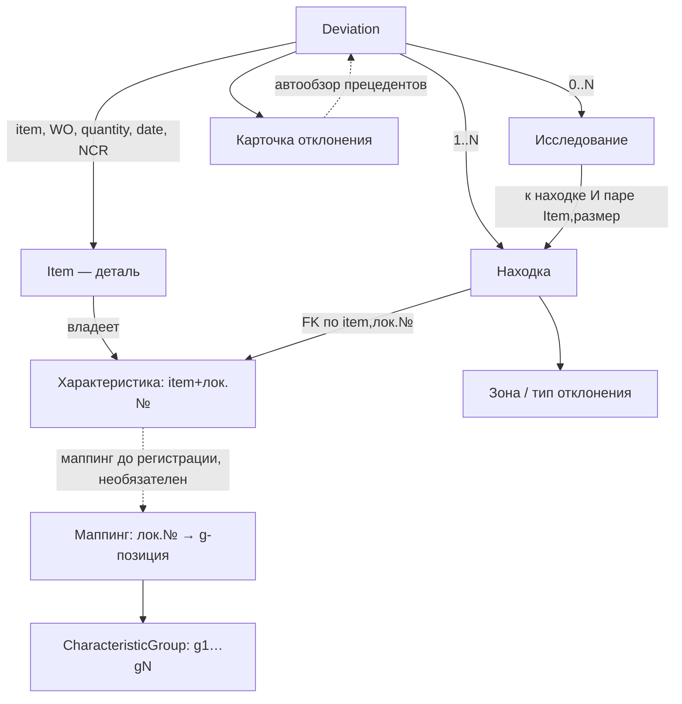

# MIS-QMS — карта репозитория (docs)

> Единый источник архитектуры MIS-QMS. **Канон модели — нарезан по сущностям в
> `model/`** (rev 1.00, QMS-002 / Волна 0b, 2026-08-10). Точка входа модели —
> `model/_overview.md`. Точка входа PM-слоя — волт `50_MIS-QMS/_BRIEF_MIS-QMS`.

## Карта разделов

| Путь | Что |
|---|---|
| `model/_overview.md` | **Канон-вход:** глоссарий, акторы, поток сохранения, процесс (9 шагов), принципы, ссылки на сущности |
| `model/Item.md` | Item — деталь (центр); справочники type/connection/size |
| `model/Characteristic.md` | Характеристика (размер); состояния (спящий state-depending) |
| `model/CharacteristicGroup.md` | CG / g-позиция (канон) **+ Маппинг** |
| `model/Deviation.md` | Deviation; исходы `decisionDev`; уровни количества; WO / NCR |
| `model/Finding.md` | Находка; метки зона / тип отклонения |
| `model/Inspection.md` | Исследование (research) |
| `model/DeviationCard.md` | Карточка отклонения — главный deliverable |
| `model/Import-Workflow.md` | Источник данных и ETL (иврит-Excel) |
| `model/Search.md` | Поиск по уровням |
| `model/reference/reference-data.md` | Справочники (типы, зона, тип отклонения, тип исследования) |
| `model/reference/output-document.md` | `אישור חריגה` — бланк DS-QC.2-2 + карта полей |
| `decisions.md` | Реестр архитектурных решений (R1/R2/R3, нарезка, зеркало) |
| `staging.md` | Этапность 1 → 1.5 → далее |
| `specs/` | UI-спеки (Add Item, редактор CG, поиск, генерация доков) — стабы, наполнение при дизайне |
| `model/CONCEPT_full_rev1.00_EN.md`, `_RU.md` | **Superseded** — короткие баннеры-указатели на нарезку |
| `model/_CONCEPT.md`, `model/_history/` | Архив: снимок A–F сессий 01–03; verbatim Session-01/02/03 |

## Проектный timeline / контроль (PM-слой, волт)

> Календарь и статус сборки ведутся в **волте** — `50_MIS-QMS/ROADMAP_MIS-QMS.md`
> (rolling-wave: детально текущий + следующий спринт; чек-листы поставок и приёмки;
> длительность в часах ёмкости, без привязки к календарю). Здесь, в репо, живёт
> **исполнение**: наряды `docs/worklog/NNNN` (единица работы Claude Code) и канон
> модели `docs/model/`. Второго роадмапа в репо нет — single source of truth.

## Зеркало и синхронизация (vault ⟵ repo)

> Канон — нарезка в `model/` (это репо). Не все сессии имеют доступ к репо (напр.
> телефон с дороги: волт подключён, репо нет). Поэтому волт держит **одно** плоское
> read-only зеркало.

- **Зеркало (волт):** `50_MIS-QMS/CONCEPT_full_rev1.00_EN.md` — плоская склейка всего
  `model/`, генерируется `tools/build_mirror.py`. Frontmatter `role: concept-mirror`,
  `source_version` = rev канона. Русское зеркало (`…_RU.md`) — **замороженный** снимок
  rev 1.00, не поддерживается; актуальный RU собирается по требованию.
- **Правило единственного источника:** канон правится **только в сессиях с
  подключённым репо.** Сессия без репо читает зеркало; правку модели кладёт в
  `50_MIS-QMS/OPEN_QUESTIONS_MIS-QMS`, канон не трогает.
- **Когда регенерировать:** при закрытии любой сессии, изменившей `model/`. Из сессии без
  репо — никогда.
- **Guard — по содержимому, а не по ручному полю (Q-09).** Генератор штампует в зеркало
  `source_hash` — sha256 по набору канон-файлов (пути относительно `docs/model/`, переводы
  строк нормализованы, поэтому checkout на Windows хеш не меняет). Проверка:
  `python tools/build_mirror.py --check <зеркало>` — пересчитывает хеш, печатает список
  вошедших файлов и вердикт, возвращает `0`/`1`, **ничего не пишет**. Прежний сторож сверял
  `source_version` с rev канона, а rev поднимался руками: пропустили подъём — сторож
  зелёный, зеркало устарело. `source_version` остаётся в шапке, но читает его человек.
- **Перенос — через мост, не записью в волт.** Генератор пишет **артефакт внутрь репо**
  (`build/mirror/`, в `.gitignore`); в волт файл переносит Cowork. Claude Code в волт не
  ходит (INFRA-013), ручного шага у пользователя не появляется.

Команды:
```
python tools/build_mirror.py --out build/mirror/CONCEPT_full_rev1.00_EN.md
python tools/build_mirror.py --check build/mirror/CONCEPT_full_rev1.00_EN.md
```

## Инструменты прогона (QMS-016)

> Оба пишут **артефакты внутрь репо** (`build/screens/`, в `.gitignore`) — та же схема, что
> у зеркала: в волт переносит Cowork. Снимки делаются на **нативной** платформе и **без**
> `show()`: offscreen для снимков непригоден (база шрифтов пуста), а окна на экран не
> всплывают — раскладку доводит `layout().activate()` (`CLAUDE.md` §9).

```
python tools/screenshots.py     # все разделы и диалоги на своей демо-базе в build/
python tools/bidi_stand.py      # стенд смешанных ивритско-английско-числовых строк
```

## Сущности (сводка) — rev 1.00

| Сущность | Что это | Ключевое |
|---|---|---|
| Item | Деталь/компонент | Центр; type/connection/size (справочники, `General`-дефолт); CG 0..N (m:n) |
| Характеристика (размер) | Атрибут Item | Ключ (item, лок.№); номер локален; CG-размеры при создании, прочие — по факту Deviation; спящий `state-depending` |
| CharacteristicGroup / g-позиция | Каноническая группа | Справочник ≈20–30; g1…gN; значения зашиты; можно создать по ходу (R3); версий нет (эт.1) |
| Маппинг | (item, лок.№) → g-позиция | Ручной, инкрементальный, **до регистрации** (R2); необязательный; код 99 = «позиции нет» |
| Deviation | Отклонение | decisionDev (4 значения); explanation; attachment; item/WO/machine/quantity/date/NCR/decision_date; находки 1..N; исследования 0..N |
| Находка | Отклонение по размеру | dimension_main/point, direction, value, comment, зона, тип; адресуема; decision НЕ несёт |
| Исследование (Inspection) | Серьёзное документированное исследование | decisionInsp независим (бинарен); к находке И паре (Item,размер); 0..N; «наука» в протоколе |
| Карточка отклонения | Рабочий экран Deviation | **Главный deliverable:** автообзор прецедентов по (Item,размер)/(CG,g) + конструктор запросов |
| Зона / тип отклонения | Справочники находки | 2-й уровень поиска; оператор пополняет, админ чистит |
| WO | Рабочий наряд `פק"ע` | Атрибут Deviation; синоним `מנה`; триггер повышения в сущность зафиксирован |

## Схема связей



## Не в волте / git

Отдельные значения (номер детали `מק"ט`, номер WO `מנה`/`פק"ע`, отдельное заключение на
иврите) сами по себе **не sensitive** — вне собранного документа ценности не несут и
сохраняются штатно (рабочая БД, тесты, примеры). В git и волт не кладётся только **целый
реальный документ/протокол с привязкой к компании** (собранный `אישור חריגה`, протокол
целиком). База автономна, не коннектится с Claude/волтом/git; парсинг детерминированный
(регулярки).
