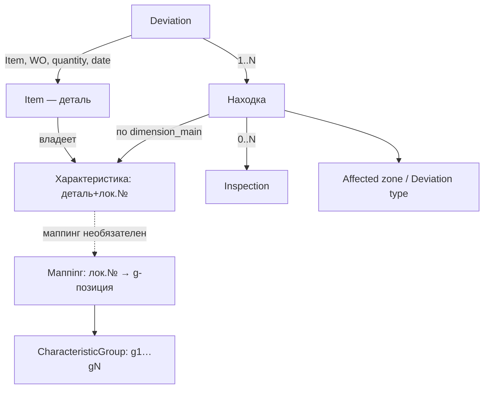

# MIS-QMS — карта репозитория (docs)

> Единый источник архитектуры MIS-QMS. Модель — draft (сессии 01–03).
> Точка входа PM-слоя — волт `50_MIS-QMS/_BRIEF_MIS-QMS`.

## Карта разделов

| Путь | Что |
|---|---|
| `model/_CONCEPT.md` | Консолидированный концепт модели (снимок сессий 01–03) — **семя** |
| `model/_history/` | Verbatim-история: Session-01 / 02 / 03 |
| `decisions.md` | Реестр архитектурных решений |
| `staging.md` | Этапность 1 → 1.5 → далее |
| `model/` (нарезка по сущностям) | **Волна 0b** — после сбора полного концепта |
| `specs/` | UI-спеки (Add Item, редактор CG, поиск) — позже |
| `reference/` | Энумы-справочники, обезличенные примеры — позже |

## Сущности (промежуточная сводка, НЕ финал)

| Сущность | Что это | Ключевое |
|---|---|---|
| Item | Деталь/компонент | Центр; type/connection/size (справочники); CG 0..N (m:n) |
| Характеристика (размер) | Атрибут Item | Ключ (деталь+лок.№); номер локален; CG-размеры при создании, прочие — по факту Deviation |
| CharacteristicGroup | Каноническая группа | Справочник ≈20–30; админ; g1…gN; значения зашиты; версий нет (эт.1) |
| Маппинг | (деталь, лок.№) → g-позиция | Ручной, инкрементальный, необязательный; код 99 = «позиции нет» |
| Deviation | Отклонение | decisionDev (живой); explanation (→אישור חריגה при одобрении); Attachment; Item/WO/machine/quantity/date; находки 1..N |
| Находка | Отклонение по размеру | dimension_main/point, direction, value, comment, Affected zone, Deviation type; адресуема; decision НЕ несёт |
| Inspection | Исследование | decisionInsp независим; к находке; 0..N; копит информацию |
| Affected zone / Deviation type | Справочники находки | Поиск; оператор пополняет, админ чистит |
| WO | Рабочий наряд | Пока атрибут Deviation; кандидат в сущности (отложено) |

## Схема связей (черновая)

> Единая финальная диаграмма собирается после закрытия открытых вопросов (`_CONCEPT.md` §E).
